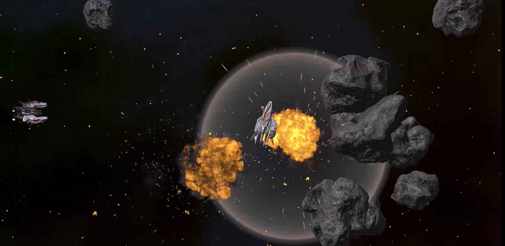
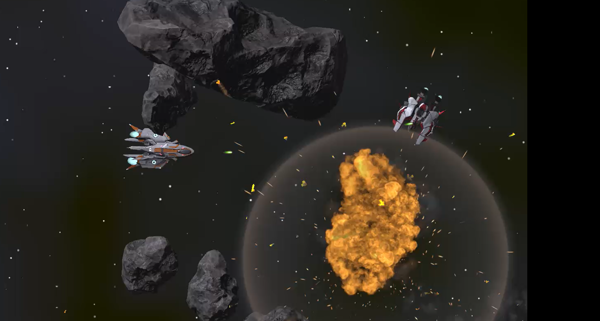
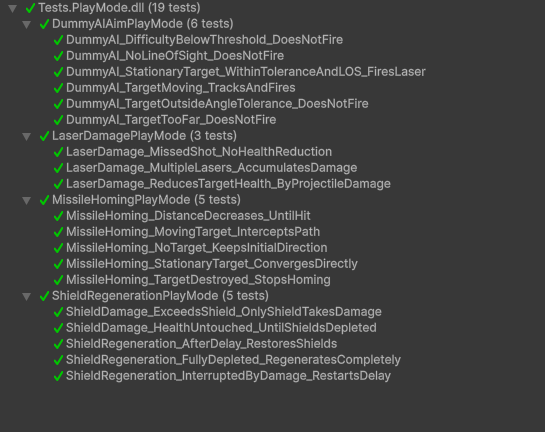

# Dogfight AIsteroids — CMSI 5998 Final Project

Welcome to the asset & documentation drop-box for **Dogfight AIsteroids**, the capstone project for Loyola Marymount University’s *CMSI 5998: AI Game Development* (Spring 2025).  The game modernises Atari’s classic *Asteroids* into a 3-D space dog-fighting prototype featuring intelligent, adaptive opponents driven by Behaviour Trees and deep Reinforcement Learning (RL).

---

## Full Source Repository
The complete Unity project, source code, training scripts, CI pipeline and additional assets live in the main repo:

**➡️  https://github.com/amindell11/astronomical-home**

Clone or fork that repository for build instructions, issue tracking and active development history.  This folder only hosts milestone artefacts referenced in the final submission.

---

## What’s in *CMSI_Final_Proj_Asteroids/*?
| File | Type | Purpose |
|------|------|---------|
| `CMSI_5998_final_proj_proposal.pdf` / `Proposal.md` | PDF | Original formal proposal submitted to the instructor outlining research goals, methodology and milestones. |
| `Presentation.pdf` / `Presentation.pptx` | Slides | Final slide deck used during the capstone presentation & demo day. |
---

## Screenshots

### Gameplay

### RL Training (Explore vs. Exploit)

The GIF below captures a single PPO training episode.  The agent has discovered that shooting the enemy yields reward spikes, but it also incurs a small **per-step penalty** to encourage shorter engagements.  You’ll notice the ship periodically **wanders** (exploration) before re-engaging when the accumulated time cost outweighs idle exploration—an emergent balance between exploring the map and exploiting the known reward of damaging the opponent.

### Testing

The Unity Test Framework (UTF) was employed for both **EditMode** and **PlayMode** tests:

* **EditMode** suites validate deterministic utilities such as path-planning, collision-damage helpers, and reward calculators.
* **PlayMode** tests spin-up headless arenas to ensure health systems, BT state transitions, and RL episode resets behave as expected.
* Continuous Integration (CI) runs all tests on every push; coverage thresholds gate merges.

Below is the final proof of a clean test run prior to submission:

---

## Quick Overview of the Project
1. **Modernised Gameplay:** Adds hull integrity, shields, missiles and concussion charges to the classic *Asteroids* formula.
2. **Baseline “Dummy” AI:** A deterministic behaviour-tree pilot provides a benchmark for learning agents and early play-tests.
3. **Deep RL Pilot:** A Proximal Policy Optimisation (PPO) agent, optionally pre-trained via Behaviour Cloning from human or baseline traces, learns to pursue, evade and survive amidst dynamic asteroid fields.
4. **Research Questions:**
   • Can deep-RL produce a convincing dog-fighting opponent in a continuous, physics-heavy arena?
   • Does Behaviour Cloning accelerate PPO convergence and improve final performance?
5. **Evaluation Pipeline:** Self-play analytics, five-player user study on believability & fun, and performance benchmarks for ≥300 concurrent AI at 60 FPS.

For in-depth methodology, see the proposal documents above and the `/reports` directory in the main repository.

---

## Getting Started
1. Clone the full project:  `git clone https://github.com/amindell11/astronomical-home.git`
2. Open the Unity project (`Unity 2022.3 LTS` recommended).
3. Press Play in `DogfightMain.unity` to fly immediately, or follow the README in the main repo for build & training instructions.

---

## License
All code is released under the main repository’s license (MIT).  Third-party assets follow their respective licenses as documented in `/ThirdPartyNotices.md` of the main repo.

---

### Contact
Questions or feedback?  Open an issue on the main repo or reach out to **Arye Mindell** at `arye.mindell@lmu.edu`.  Contributions & forks are welcome! 