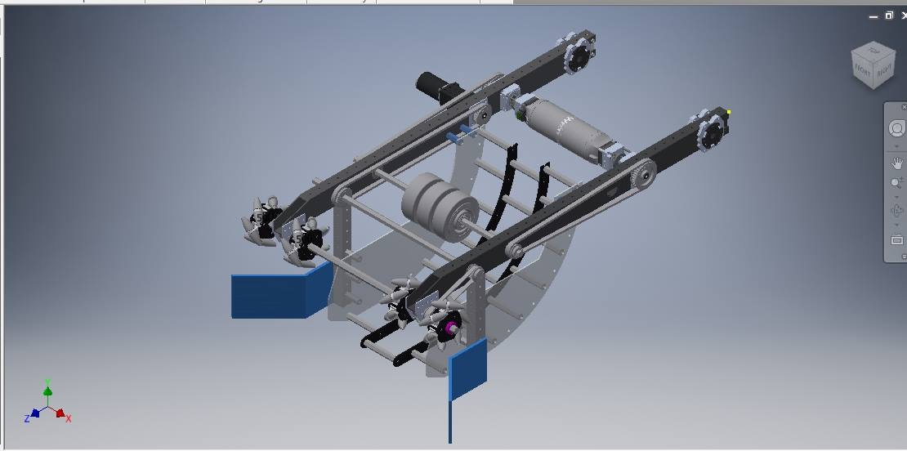
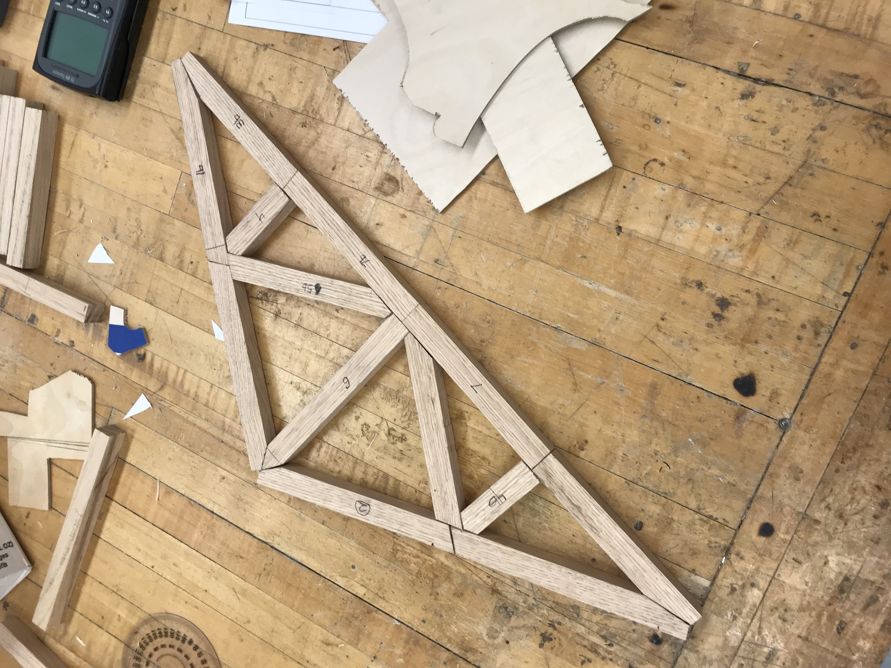
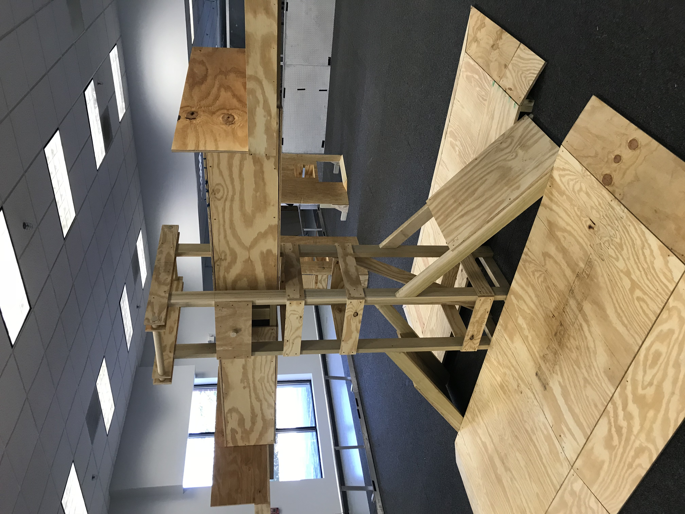
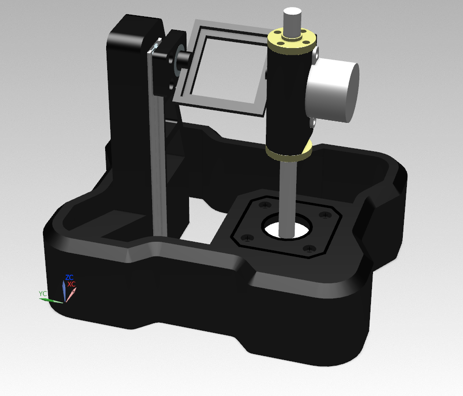
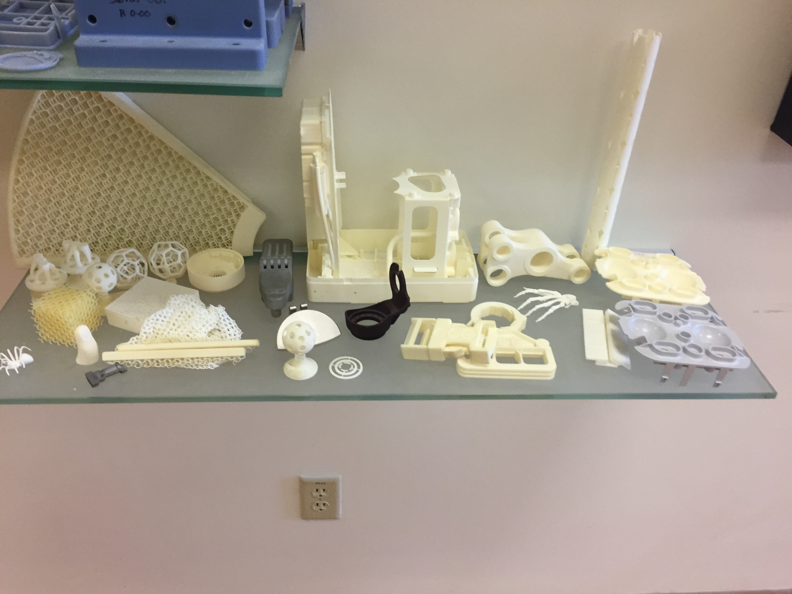
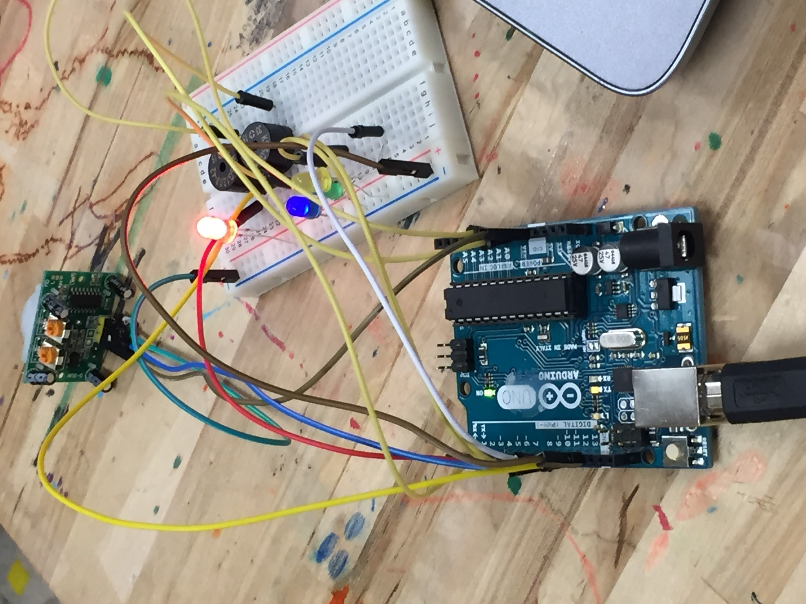
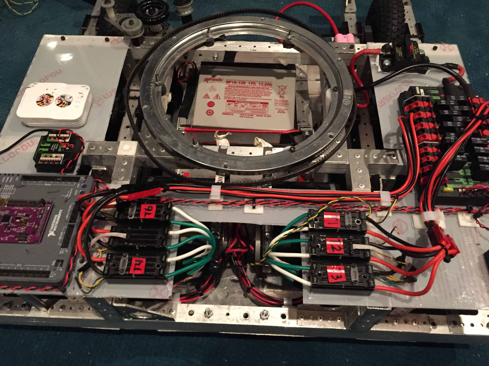

# Miscellaneous Projects

This folder contains images and brief descriptions of various engineering projects I've completed, demonstrating practical application of mechanical design, electronics integration, and prototyping skills.

## Project Highlights

- **FRC 1389 Maelstrom Shooter Arm Redesign:**
  - Redesigned the robot's shooter/intake arm for reduced weight and improved ball centering using mecanum wheels for enhanced intake efficiency.  
  

- **Truss Design:**
  - Engineered a wooden truss structure using static analysis principles to optimize load-bearing capacity.  
  

- **FRC Field Replica:**
  - Constructed a detailed replica of an FRC field piece using plywood and standard lumber for realistic practice and testing scenarios.  
  

- **IMU Testing Tilt Table:**
  - Developed a custom tilt table from off-the-shelf and 3D printed parts, designed to test an Inertial Measurement Unit (IMU) sensor against known positional benchmarks.  
  

- **Miscellaneous 3D Printed Parts:**
  - Created various functional and educational components during my tenure at the KID Museum's 3D Design Lab in Bethesda, MD.  
  

- **Ultrasonic Doorbell:**
  - Designed and built a basic Arduino-powered ultrasonic sensor circuit for educational workshops teaching DIY electronics.  
  

- **Maelstrom Electrical Board Design:**
  - Managed detailed electrical layout planning and wire organization for robot electronics, specifically handling challenges associated with electronics mounted on a rotating turret and Lazy Susan assembly.  
  
